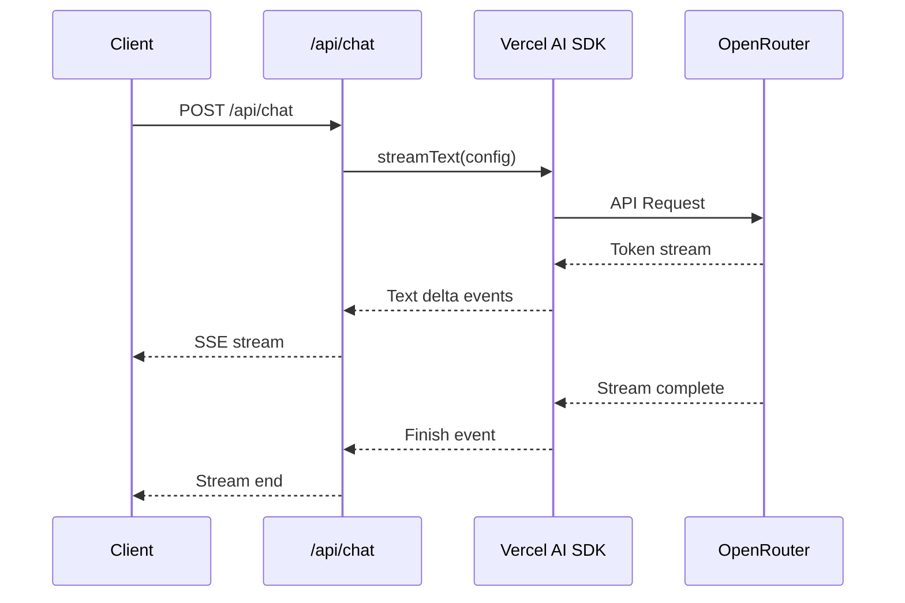

# APIリファレンス

このドキュメントでは、チャットアプリケーションのAPIエンドポイント仕様について説明します。

## 目次

- [概要](#概要)
- [エンドポイント: POST /api/chat](#エンドポイント-post-apichat)
- [リクエスト形式](#リクエスト形式)
- [レスポンス形式](#レスポンス形式)
- [エラーレスポンス](#エラーレスポンス)
- [ストリーミングの詳細](#ストリーミングの詳細)

## 概要

チャットアプリケーションのAPIは、Next.js 15.5のApp Router機能を使用して実装されています。

- **実装場所**: `app/api/chat/route.ts`
- **プロトコル**: HTTP/1.1、HTTP/2
- **レスポンス形式**: Server-Sent Events (SSE) によるストリーミング

## エンドポイント: POST /api/chat

AIモデルとの対話を行うためのメインエンドポイントです。

### 基本情報

| 項目 | 値 |
|-----|-----|
| URL | `/api/chat` |
| Method | POST |
| Content-Type | `application/json` |
| レスポンスタイプ | `text/event-stream` (ストリーミング) |

### 認証

このエンドポイントは現在認証を必要としません。OpenRouter APIキーはサーバーサイドで管理されています。

### レート制限

- クライアント側: 制限なし
- OpenRouter側: APIキーごとの制限が適用されます（OpenRouterのプランによる）

## リクエスト形式

### リクエストボディ

```typescript
interface ChatRequest {
  messages: UIMessage[];
}
```

### UIMessage型

Vercel AI SDK v2の`UIMessage`型を使用します：

```typescript
interface UIMessage {
  id: string;
  role: "user" | "assistant" | "system";
  parts: Array<{
    type: "text";
    text: string;
  }>;
}
```

### リクエスト例

```json
{
  "messages": [
    {
      "id": "msg-1",
      "role": "user",
      "parts": [
        {
          "type": "text",
          "text": "こんにちは"
        }
      ]
    }
  ]
}
```

### バリデーションルール

| フィールド | ルール |
|-----------|--------|
| messages | 必須、非空配列 |
| messages[].role | 必須、`"user"` \| `"assistant"` \| `"system"` のいずれか |
| messages[].parts | 必須、非空配列 |
| messages[].parts[].type | 必須、`"text"` |
| messages[].parts[].text | 必須、非空文字列 |

## レスポンス形式

### 成功レスポンス

APIは、Server-Sent Events (SSE) 形式でストリーミングレスポンスを返します。

#### レスポンスヘッダー

```
Content-Type: text/event-stream
Cache-Control: no-cache
Connection: keep-alive
```

#### レスポンスボディ

ストリーミング形式で、逐次的にデータが送信されます。Vercel AI SDKの`toUIMessageStreamResponse()`メソッドが生成するフォーマットです。

### レスポンス例

```http
HTTP/1.1 200 OK
Content-Type: text/event-stream
Cache-Control: no-cache
Connection: keep-alive

data: {"type":"text-delta","textDelta":"こんにち"}

data: {"type":"text-delta","textDelta":"は！"}

data: {"type":"finish","finishReason":"stop"}
```

### ストリーミングイベントタイプ

Vercel AI SDK v2が送信する主なイベントタイプ：

| イベントタイプ | 説明 | データ |
|--------------|------|--------|
| `text-delta` | テキストチャンクの追加 | `{ textDelta: string }` |
| `finish` | ストリーミング完了 | `{ finishReason: string }` |
| `error` | エラー発生 | `{ error: string }` |

## エラーレスポンス

### エラーレスポンス形式

```typescript
interface ErrorResponse {
  error: {
    type: ErrorType;
    message: string;
    code: string;
  };
}

type ErrorType =
  | "validation_error"
  | "authentication_error"
  | "rate_limit_error"
  | "api_error";
```

### HTTPステータスコード

| ステータスコード | エラータイプ | 説明 |
|----------------|------------|------|
| 400 Bad Request | `validation_error` | リクエストボディが無効（messagesが空など） |
| 401 Unauthorized | `authentication_error` | OpenRouter APIキーが未設定または無効 |
| 429 Too Many Requests | `rate_limit_error` | レート制限超過 |
| 500 Internal Server Error | `api_error` | サーバー内部エラー |
| 502 Bad Gateway | `api_error` | OpenRouter APIエラー |

### エラーレスポンス例

#### 400 Bad Request（メッセージが空）

```json
{
  "error": {
    "type": "api_error",
    "message": "Messages array must not be empty",
    "code": "INVALID_MESSAGES"
  }
}
```

#### 500 Internal Server Error（APIキー未設定）

```json
{
  "error": {
    "type": "api_error",
    "message": "OPENROUTER_API_KEY environment variable is not set",
    "code": "OPENROUTER_INIT_ERROR"
  }
}
```

#### 500 Internal Server Error（予期しないエラー）

```json
{
  "error": {
    "type": "api_error",
    "message": "An unexpected error occurred",
    "code": "INTERNAL_ERROR"
  }
}
```

## ストリーミングの詳細

### Server-Sent Events (SSE)

このAPIは、Server-Sent Events (SSE) プロトコルを使用してストリーミングレスポンスを送信します。

### ストリーミングフロー



### ストリーミングの接続管理

- **接続の開始**: クライアントがPOSTリクエストを送信
- **接続の維持**: サーバーは`Connection: keep-alive`ヘッダーで接続を維持
- **接続の終了**: ストリーミング完了時に自動的に接続が閉じられる

### クライアント側での受信

Vercel AI SDKの`useChat`フックを使用すると、ストリーミングレスポンスの受信が自動的に処理されます：

```typescript
import { useChat } from "@ai-sdk/react";

const { messages, sendMessage, status } = useChat();

// メッセージ送信
sendMessage({ text: "こんにちは" });

// ストリーミング状態の確認
console.log(status); // "ready" | "submitted" | "streaming" | "error"
```

## API実装の詳細

### 実装コード（抜粋）

```typescript
// app/api/chat/route.ts
import { convertToModelMessages, streamText, type UIMessage } from "ai";
import { createErrorResponse } from "@/app/lib/errors";
import { getOpenRouterModel } from "@/app/lib/openrouter";

export async function POST(request: Request) {
  try {
    // リクエストボディのパース
    const { messages }: { messages: UIMessage[] } = await request.json();

    // メッセージ配列の検証
    if (!messages || messages.length === 0) {
      return Response.json(
        createErrorResponse(
          "api_error",
          "Messages array must not be empty",
          "INVALID_MESSAGES",
        ),
        { status: 500 },
      );
    }

    // OpenRouterモデルの取得
    let model: ReturnType<typeof getOpenRouterModel>;
    try {
      model = getOpenRouterModel();
    } catch (error) {
      const errorMessage =
        error instanceof Error ? error.message : "Unknown error";
      console.error("OpenRouter initialization error:", errorMessage);

      return Response.json(
        createErrorResponse("api_error", errorMessage, "OPENROUTER_INIT_ERROR"),
        { status: 500 },
      );
    }

    // ストリーミングレスポンスの生成
    const result = streamText({
      model,
      messages: convertToModelMessages(messages),
    });

    // ストリーミングレスポンスを返す
    return result.toUIMessageStreamResponse();
  } catch (error) {
    console.error("Chat API error:", error);

    const errorMessage =
      error instanceof Error ? error.message : "An unexpected error occurred";

    return Response.json(
      createErrorResponse("api_error", errorMessage, "INTERNAL_ERROR"),
      { status: 500 },
    );
  }
}
```

### エラーハンドリングユーティリティ

```typescript
// app/lib/errors.ts
import type { OpenRouterError, ErrorType } from "@/app/types/error";

export function createErrorResponse(
  type: ErrorType,
  message: string,
  code: string
): OpenRouterError {
  return {
    error: {
      type,
      message,
      code,
    },
  };
}
```

## 参考リンク

- [型定義リファレンス](./type-definitions.md) - 詳細な型定義
- [OpenRouter統合ガイド](./openrouter-integration.md) - OpenRouterの設定方法
- [実装ガイド](./implementation-guide.md) - クライアント・サーバー実装の詳細
- [Vercel AI SDK Documentation](https://ai-sdk.dev/) - Vercel AI SDKの公式ドキュメント
- [Server-Sent Events (MDN)](https://developer.mozilla.org/en-US/docs/Web/API/Server-sent_events) - SSEの詳細
